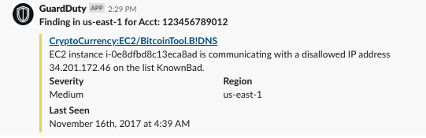
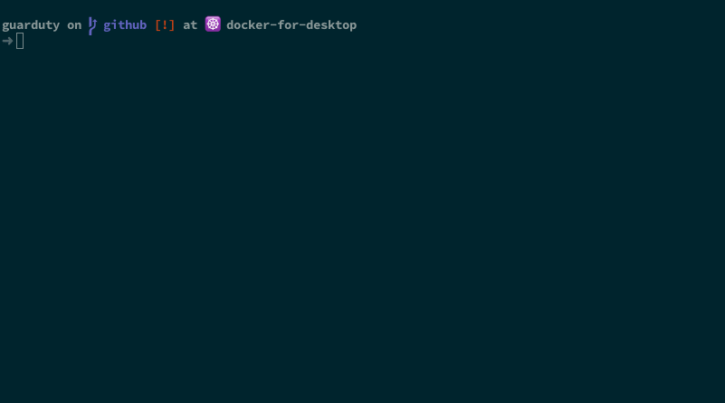

# GuardDuty Controller


[]()


**Create a stack**



---

## Table of Contents (Optional)

- [Installation](#installation)
- [Features](#features)
- [Contributing](#contributing)
- [Support](#support)
- [License](#license)


---

## Installation

### Step 1:
Create an incoming webhook in slack
- Go to your slack application and select your team on the top left corner as shown:
- You will find a popup Menu and you’ll want to click on Manage Apps.
- You will then want to select custom integrations on the left and Incoming Webhooks.
- Select the slack channel that you’d like to post messages to with this new incoming web hook.  An example would be #general.
- Press the button to add the incoming web hook at the bottom of the page.
- Copy the new Webhook URL so we can use it as input in our CloudFormation template.

### Step 2:
Use the CloudFormation service to execute the gd2slack.template in this repository
- You will add your incoming web hook as the first parameter [cloudformation/_cim.yml](cloudformation/_cim.yml)
- Add the slack channel as a parameter - example #general
- Add the minimum severity - example HIGH would only send high severity findings, LOW sends all findings
- Run make apply

### Thats it!  The template will run for about 5 minutes and you are ready to go.
---

## Cim Config

> In order to pass parameter to cloudformation do not edit the template, but
> instead modify the _cim.yml configuration file located in the cloudformation/ directory.

```shell
version: 0.1
stack:
  name: guardDutyToSlackNotifier

  template:
    file: g2s.yaml
    bucket: cim-stacks-upload

  parameters:
    IncomingWebHookURL: 'https://hooks.slack.com/services/XXXXXX/YYYYY/REPLACE_WITH_YOURS'
    SlackChannel: '#general'
    MinSeverityLevel: 'LOW'

  capabilities:
    - 'CAPABILITY_IAM'
  tags:
    app: guardDutyToSlackNotifier
    owner: DevSecOps
env: prod
```

## Features
## Usage (Optional)
## Documentation (Optional)
## Tests (Optional)

---

## Contributing

> To get started...

### Step 1

- **Option 1**
    - 🍴 Fork this repo!

- **Option 2**
    - 👯 Clone this repo to your local machine using `https://github.com/einyx/guarduty.git`

### Step 2

- **HACK AWAY!** 🔨🔨🔨

### Step 3

- 🔃 Create a new pull request using <a href="https://github.com/einyx/guarduty/compare/" target="_blank">`https://github.com/einyx/guarduty/compare/`</a>.

---

## Donations (Optional)


---

## License

[](http://badges.mit-license.org)

- **[MIT license](https://opensource.org/licenses/mit-license.php)**
- Copyright 2019 © <a href="http://devsecnull.io" target="_blank">devsecnull</a>.

> GitHub [@einyx](https://github.com/einyx) &nbsp;&middot;&nbsp;

[MIT]: http://mit-license.org/
[contributors]: http://github.com/einyx/

